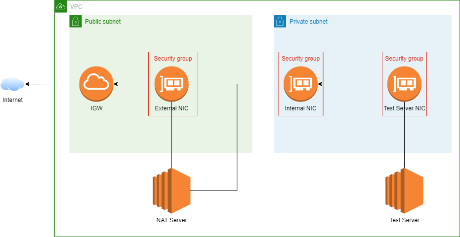

# AWSNATServer

This project is an example on how to build a NAT Server. This project uses Terraform to deploy the NAT server and a test server to test NAT is working. 

# The design

# How it works.

The nat server on first boot will configure iptables with NAT and configure all of the needed forwarding rules. Both servers are configured with AWS IAM roles so you can connect through AWS SSM to the server. Once deployed and the userdata scripts run you should be able to connect via SSM to both the NAT Server and Test Server. Note it may take a few minutes for the userdata scripts to run.

You can find more information on [https://www.projectferris.com/?page_name=AWSNATServer](https://www.projectferris.com/?page_name=AWSNATServer)